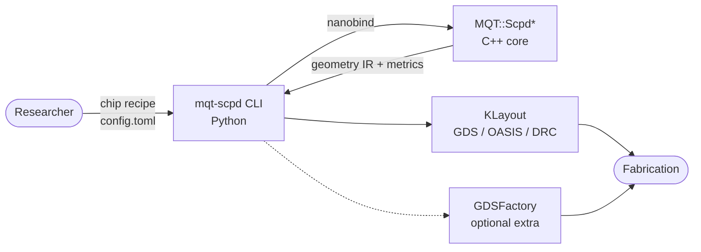
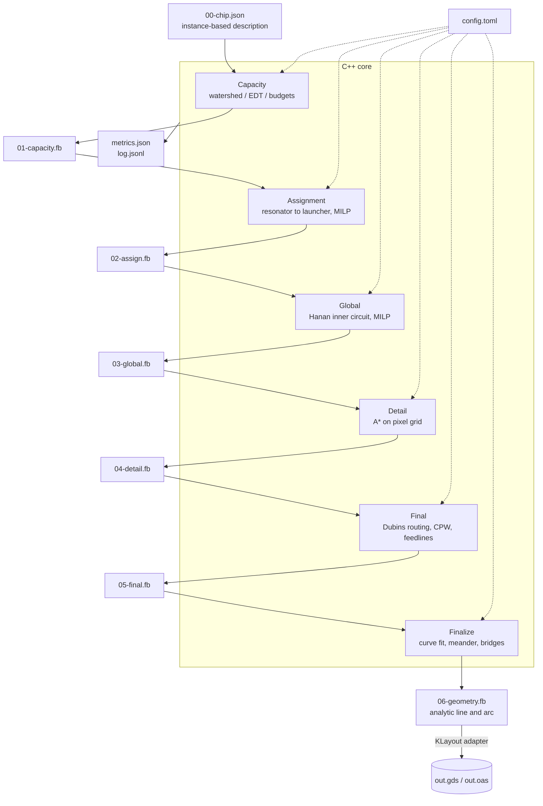
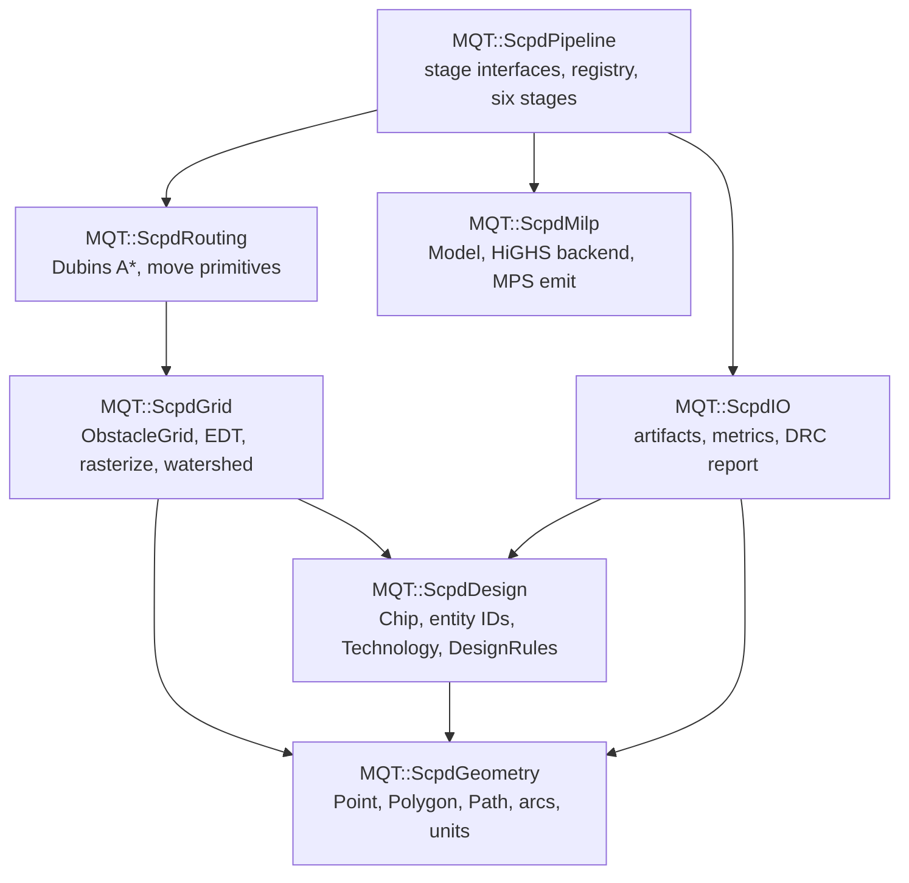
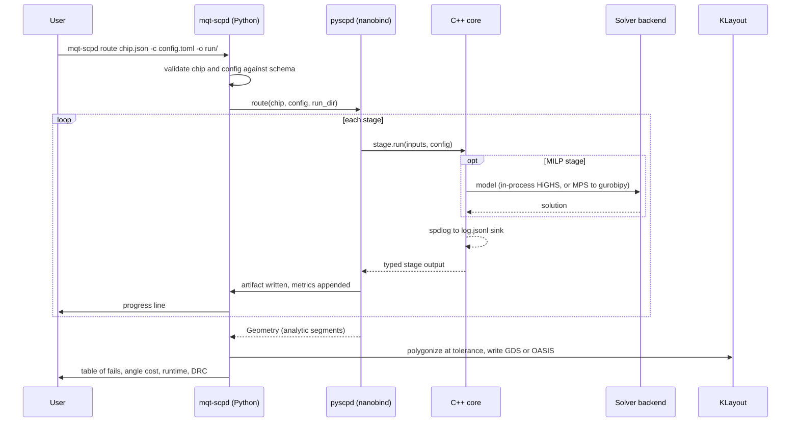

# MQT SCPD Architecture

This document is the authority on module boundaries and dependency direction for
MQT SCPD. It describes the target architecture for the rewrite of the FridgeCAD
prototype into this repository.

Companion documents:

- [Data model](docs/design/data-model.md) — entities, coordinate systems
- [Pipeline](docs/design/pipeline.md) — stage contracts, artifacts, resume
- [Roadmap](docs/design/roadmap.md) — phased plan with acceptance criteria
- [Decisions](docs/design/decisions/) — one record per architectural decision
- [Porting notes](docs/design/porting-notes.md) — map of the prototype

Diagrams are Mermaid and render on GitHub. These design documents are excluded
from the Sphinx build; they target contributors, not users.

## What the tool does

MQT SCPD takes a description of a superconducting quantum chip — qubits,
couplers, launchers and obstacle geometry — and produces manufacturable
coplanar-waveguide routing: every resonator connected to a launcher, every wire
curvature-constrained, and every design rule satisfied. The output is GDSII or
OASIS.

## Guiding principles

1. **The C++ core is pure.** It never opens a file, never writes to `stdout`,
   and never links a layout library. It consumes typed inputs and returns typed
   outputs. Python owns argument parsing, file orchestration, and rendering.
2. **Stages are values in, values out.** Every stage entry point is `const` and
   takes its inputs by `const&`. No stage mutates another stage's state.
3. **One vocabulary per concept.** One point type per coordinate system, one
   design-rule struct, one path representation. The prototype had eight point
   types and three contradictory clearance constants.
4. **Derived state is never an artifact.** Grids and router containers are
   rebuilt deterministically from the chip and the configuration.
5. **Minimum viable structure.** Abstractions exist where a second
   implementation is already planned or a dependency must be swappable. Nowhere
   else.

## Level 1 — System context



The CLI is the product. The Python API exists and is importable, but it is
documented as internal and unstable. See
[decision 0002](docs/design/decisions/0002-cli-is-the-product.md).

## Level 2 — Pipeline and artifacts



Each stage is independently runnable and resumable. Full contracts are in
[the pipeline document](docs/design/pipeline.md).

**The geometry IR carries analytic segments** — lines and circular arcs with
exact centre and radius — not sampled points. The router already produces Dubins
paths; sampling early and reconstructing arc structure afterwards loses
precision and wastes work. Polygonization happens once, in the export adapter,
at a configured tolerance.

## Level 3 — Modules

Seven libraries, following the per-module pattern of MQT Core rather than a
single flat target. Public headers live under `include/mqt-scpd/<module>/` and
sources mirror them under `src/<module>/`.



The dependency graph is acyclic. Nothing depends on `pipeline`; it is the top.

| Target              | Alias               | Responsibility                                                                             |
| ------------------- | ------------------- | ------------------------------------------------------------------------------------------ |
| `mqt-scpd-geometry` | `MQT::ScpdGeometry` | Point, polygon, path with line and arc segments, transforms, unit handling                 |
| `mqt-scpd-design`   | `MQT::ScpdDesign`   | The chip entity model, cell library and instances, technology and design rules             |
| `mqt-scpd-grid`     | `MQT::ScpdGrid`     | Rasterization, Euclidean distance transform, watershed partitioning, packed obstacle grids |
| `mqt-scpd-routing`  | `MQT::ScpdRouting`  | Curvature-constrained A* over Dubins primitives                                            |
| `mqt-scpd-milp`     | `MQT::ScpdMilp`     | Solver-neutral model assembly, HiGHS backend, MPS emission for the BYOK path               |
| `mqt-scpd-pipeline` | `MQT::ScpdPipeline` | Stage interfaces, the implementation registry, and the six stage implementations           |
| `mqt-scpd-io`       | `MQT::ScpdIO`       | Artifact read and write, metrics, design-rule reporting                                    |

Each is declared through `cmake/AddMQTScpdLibrary.cmake`, adapted from MQT
Core's `AddMQTCoreLibrary.cmake`: `FILE_SET HEADERS`, `generate_export_header`,
the `MQT::` export namespace, and a per-module `test/<module>/CMakeLists.txt`
that globs its own tests.

### Stage interfaces


Every `run` is `const` and takes inputs by `const&`. That single constraint
removes three prototype defects at once: the chip is no longer copied by value
into three stages, no stage writes into another's queue mid-solve, and the
signatures are already shaped for the threading work in phase 2.

The registry is a `map<string, factory>` — roughly thirty lines. It exists
because algorithm swapping is a stated requirement of a research tool, not on
speculation. There is no plugin loading and no configuration language.

## Level 4 — A run



## Repository layout

```text
mqt-scpd/
  schemas/*.fbs                          the data model, single source of truth
  include/mqt-scpd/<module>/*.hpp        public headers
  include/mqt-scpd/generated/            committed, via nox -s schemas
  src/<module>/                          mirrors include/
  bindings/bindings.cpp                  minimal: run pipeline, read metrics
  python/mqt/scpd/
    cli.py                               argparse subcommands
    gen.py                               lattice chip generator
    convert.py                           legacy config to chip.json
    solvers/gurobipy_backend.py          BYOK Gurobi via MPS
    export/klayout.py                    GDS and OASIS
    export/gdsfactory.py                 optional extra
    report.py                            tables from metrics.json
    plot.py                              debug plotter from the geometry IR
  test/<module>/*.cpp                    GoogleTest, per module
  test/python/{unit,property,integration}/
  benchmarks/recipes/*.toml
  docs/design/                           these documents
```

## Dependencies

| Layer         | Dependency    | Acquisition                      | Why                                                                                  |
| ------------- | ------------- | -------------------------------- | ------------------------------------------------------------------------------------ |
| C++           | FlatBuffers   | FetchContent                     | Schema-generated data model; the parser validates JSON input against the same schema |
| C++           | nlohmann/json | FetchContent                     | Metrics and logs only                                                                |
| C++           | spdlog        | FetchContent                     | Structured logging; replaces scattered `std::cout`                                   |
| C++           | HiGHS         | FetchContent                     | Default solver; makes an unlicensed install fully functional                         |
| C++           | Boost.Polygon | FetchContent or vendored headers | One Voronoi construction. Never a user-installed Boost                               |
| C++           | GoogleTest    | FetchContent                     | Existing repository convention                                                       |
| Python        | klayout       | PyPI                             | GDS and OASIS, DRC, rendering                                                        |
| Python        | rich          | PyPI                             | Progress over long runs, and result tables                                           |
| Python (test) | hypothesis    | PyPI                             | Property-based tests                                                                 |
| Optional      | gurobipy      | user-installed                   | Bring-your-own-license solver path                                                   |
| Optional      | gdsfactory    | `mqt-scpd[gdsfactory]`           | Adapter over the same geometry IR                                                    |

The CLI uses the standard library's `argparse`. Dependencies are declared in
`cmake/ExternalDependencies.cmake`, never inline in a target.

## What we deliberately do not build

Recorded so that future contributors do not add them speculatively.

- No generic pass base class and no plugin loading. Typed interfaces and a name
  map, nothing more.
- No layer axis, via model, or three-dimensional routing graph. The design stays
  planar until flip-chip work actually begins.
- No custom geometry library beyond what the stages use, and no expression
  templates in the MILP layer.
- No CLI or argument parsing in C++, and no file paths inside the core.
- No GDS writer of our own, and no SVG writer of our own.
- No hand-written struct for anything a schema already describes, and no second
  schema language.
- No schema constraints on metrics. They stay loose JSON on purpose.
- No golden metric pins in the test suite.
- No second implementation of any stage in the first release. The registry ships
  with one entry each.
