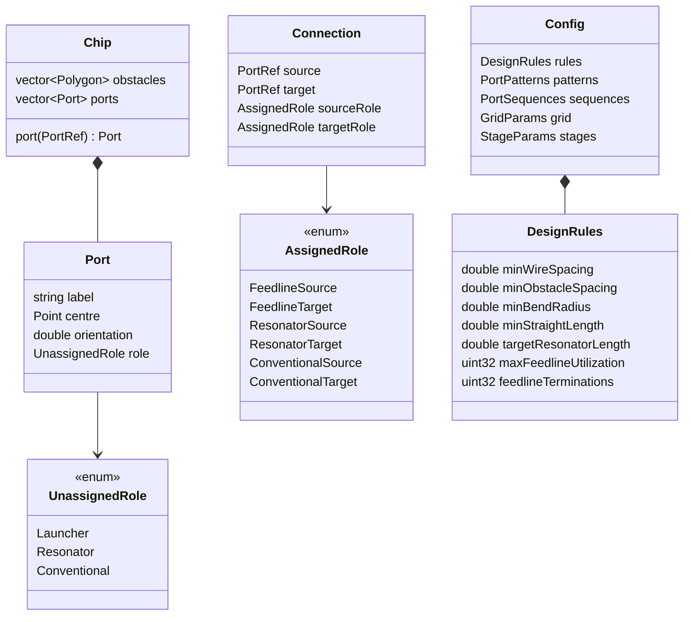

# Data model

The FlatBuffers schemas in `schemas/` are normative. This document explains
them: what the entities mean, which coordinate system each value lives in, and
which prototype defect each design choice removes.

## Why this exists

In the FridgeCAD prototype there was no data model. What a port *is* was encoded
in its label and recovered by string matching at the point of use, and the tests
did not agree with each other:

- A launcher was any port whose label started with `Chip`.
- A routable port was any label starting with `Q` — which also matches `Qb`, and
  in a different function the test was `Qb`, which does not match the 4-qubit
  chip's `Q1.port0` at all.
- Which port indices counted as "key" ports was a separate hard-coded rule
  again: `port0`/`port1` for qubits, `port0`/`port2`/`port3` for couplers.
- The qubit pair belonging to a coupler was recovered by parsing the digits out
  of names like `Coupler13_14`.
- Synthetic labels such as `CouplerLauncher1_Chip.port1first` could not be
  parsed back into their parts, which forced a special case in the clearance
  checker.

Two decisions remove all of it. Roles are **declared, not inferred** — see
[decision 0018](decisions/0018-port-roles-unassigned-and-assigned.md) — and the
one relationship those string parsers existed to recover, a coupler's qubit
pair, is needed by nothing that survives. The port ring is the only thing that
ever wanted it, and neither way of obtaining a ring asks for it now: under
`port_detection = "manual"` the ring is configuration
([decision 0020](decisions/0020-legacy-routing-config-as-input.md)), and under
`"auto"` it comes from a geometric traversal that parses no names
([decision 0023](decisions/0023-geometric-port-ring-detection.md)).

## Entities



### Identity

A port is identified by its label, which is a string, and that is deliberate:
the chip input is the prototype's own JSON and its labels are the only names the
benchmarks have. What changed is that
**no algorithm branches on the spelling of one**. Labels are resolved to a
`PortRef` — a dense index into `Chip::ports` — exactly once, at load, and every
stage works in indices.

The rule that matters: *a label is looked up, never parsed*. There is no code
that reads digits out of `Coupler13_14`, and no code that tests a prefix.

### Roles: unassigned in, assigned out

Roles come in two enums, with a defined transition between them.

```fbs
/// What a port is, before anything is decided. Set at load, from patterns.
enum UnassignedRole : ubyte { Launcher, Resonator, Conventional }

/// What a port does in the solved design. Set by the Assignment stage.
enum AssignedRole : ubyte {
  FeedlineSource,     FeedlineTarget,
  ResonatorSource,    ResonatorTarget,
  ConventionalSource, ConventionalTarget,
}
```

`UnassignedRole` is a property of a **port** and comes from the regular
expressions in `config.toml`. `AssignedRole` is a property of a
**connection endpoint** and cannot exist before the assignment is solved,
because until then no port is anyone's source or target.

The prototype conflated the two, which is why `is_resonator` was a `bool` on a
routing request in one place and a `NodeKind` on a graph node in another.

| `AssignedRole`                              | Where it comes from                                                                       |
| ------------------------------------------- | ----------------------------------------------------------------------------------------- |
| `FeedlineSource` / `FeedlineTarget`         | The two launcher-terminated ends of a feedline chain                                      |
| `ResonatorTarget`                           | A `Resonator` port that the assignment gave a launcher                                    |
| `ResonatorSource`                           | **Only ever a CPW coupler port** — see below                                              |
| `ConventionalSource` / `ConventionalTarget` | The endpoints of a non-resonator connection                                               |

`ResonatorSource` is the case that shapes the schema. A resonator runs from the
CPW coupler that taps the feedline to the qubit's readout port — so its source
port **does not exist in the chip input**. The Assignment stage decides that a
resonator is fed; the Final stage's coupler insertion materializes the port that
carries the role. `Chip::ports` therefore grows during a run, and `PortRef` must
stay valid across that growth: ports are appended, never reordered or removed.

### Patterns, not prefixes

`UnassignedRole` is assigned by matching each label against one regular
expression per role, given per chip in `config.toml`:

```toml
[ports.patterns]
launcher     = '^Chip\.port\d+$'
resonator    = '^Qb?\d+\.port0$'
conventional = '^(Qb?\d+\.port1|Coupler\d+_\d+\.port[0-4])$'
```

Every port must match **exactly one** pattern. A port matching none, or more
than one, is a load error naming the label and the patterns involved — this is
what turns the prototype's silent misclassification into a message.
`mqt-scpd doctor` prints the resulting classification table, so a wrong regex is
visible in a second rather than after a 456-second run.

The 4-qubit chip's `Q1.port0` and the 69-qubit chip's `Qb1.port0` are handled by
two different config files, not by a prefix test that has to satisfy both.

### Geometry

`Chip` stores obstacle geometry as flat polygons, exactly as the input carries
them. This is the prototype's representation and it is kept on purpose: the
benchmark inputs are unchanged, so the routing baseline is unchanged.

It is not free. The 69-qubit input is 34 MB holding 13,316 fully expanded
polygons, overwhelmingly repeated qubit and coupler artwork. A cell library plus
placements — the hierarchy GDSII itself uses — would express the same chip in
tens of kilobytes. That is recorded as follow-up work in
[decision 0020](decisions/0020-legacy-routing-config-as-input.md), gated on the
routing quality baseline existing first.

### Couplers and bridges are outputs

Neither appears in the chip input. Both are instantiated during the run, with
their dimensions taken from `config.toml`.

| Component    | Instantiated by                                | Stage    |
| ------------ | ---------------------------------------------- | -------- |
| `CpwCoupler` | Coupler insertion in the final router          | Final    |
| `Bridge`     | The finalizer, where a feedline crosses a wire | Finalize |

Each carries **exact dimensions in layout units**. The router separately holds a
rasterized footprint for obstacle marking, and that footprint is
`cells_for(dimension, grid)` — never a second authored number. In the prototype
these were two independent constants that happened to agree:
`CPWCoupler{length = 20, height = 3}` cells is exactly the physical 200 × 26
coupler at the final grid's cell size, and nothing recorded that they were the
same fact.

## Design rules

`DesignRules` is one struct, threaded through every stage, and it is the only
place a clearance value may come from.

```fbs
table DesignRules {
  min_wire_spacing:           double;  // 185.0
  min_obstacle_spacing:       double;  //  25.0
  min_bend_radius:            double;  //  50.0
  min_straight_length:        double;  // 100.0
  target_resonator_length:    double;  // varies per chip
  resonator_length_tolerance: double;  // 100.0
  max_feedline_utilization:   uint32;  // 4..7, varies per chip
  feedline_terminations:      uint32;  // 0..1, varies per chip
}
```

Three notes on the set itself:

- **`min_straight_length` subsumes the prototype's `CON_PORT_EXTENSION`.** The
  straight run out of a port and the minimum straight run between two curvature
  changes are the same physical rule at the same value, 100.0. Two names for one
  rule is exactly the failure mode this struct exists to end.
- **`max_feedline_utilization`** caps how many wires a single routing corridor
  may carry. It is a manufacturability bound on the assignment, not a solver
  knob, which is why it lives here.
- **`resonator_length_tolerance`** is the half-width of the band a resonator's
  fitted length must land in, and it is the rule DRCPolice's `resonator-length`
  check enforces. It is a rule rather than a checker setting because a resonator
  whose length is out of band is the wrong frequency, which is a property of the
  chip and not of the checking.
- **`feedline_terminations`** is the number of extra endpoints the assignment
  may terminate a feedline at when no crossing-free assignment exists on the
  ring. The prototype called it `fake_endpoints`; the terminations it adds are
  real, so the name is not.

### Rules are physical; grids convert

Every rule is a length in layout units. A stage that works in grid space obtains
a cell count through one function, and only through that function:

```cpp
/// Cells on `g` that span at least `distance` layout units.
[[nodiscard]] uint32_t cells_for(double distance, const GridMetrics& g);
```

That single rule replaces every clearance literal in the prototype:

| Consumer                                          | Prototype        | Derived                                               |
| ------------------------------------------------- | ---------------- | ----------------------------------------------------- |
| Capacity: launcher keep-out, border budget, stubs | physical already | unchanged                                             |
| Detail: cross-boundary blockade                   | computed         | `cells_for(min_wire_spacing, detail) - 1`             |
| Detail: inner-routing blockade                    | literal `6`      | the **same** expression — the one real inconsistency  |
| Final: inner and outer wire clearance             | literal `19`     | `cells_for(min_wire_spacing, final)`, which **is** 19 |
| Final: refinement clearance                       | literal `19`     | the same call                                         |
| Final: straight-start stubs                       | literal `9`      | `cells_for(min_straight_length, final)`               |
| Final: coupler footprint                          | `20 × 3` cells   | `cells_for` of 200.0 × 26.0                           |
| Final: bridge footprint                           | `6 × 6` cells    | `cells_for` of 60.0 × 60.0                            |

The final grid's cell size is 9.91–10.00 layout units on every benchmark, so
`ceil(185 / cell)` is 18.5–18.7 → **19** on all eight. The prototype's literal
was right; nothing in the prototype recorded *why*, so nothing could have caught
it drifting.

Two of these are not constant across chips, and making them derived therefore
changes behaviour: the detail-grid blockade becomes 4–9 rather than a fixed 6,
and the straight-start stub becomes 10–11 rather than a fixed 9. That is the
point — one literal cannot be correct on eight differently-scaled grids. Both
are validated by benchmark result in phase 4, and a chip that genuinely needs a
different value gets a documented override rather than a reverted rule.

## Coordinate systems

Four coordinate systems exist. Confusing them was a recurring source of defects,
so each has a distinct type and conversions are explicit.

| Space       | Type     | Unit                    | Where it is valid                                                   |
| ----------- | -------- | ----------------------- | ------------------------------------------------------------------- |
| Layout      | `Point`  | micrometres as `double` | The chip description, the geometry IR, all design rules, GDS export |
| Coarse grid | `GCoord` | cell index              | Capacity planning: partitions, budgets, chains                      |
| Detail grid | `DCoord` | pixel index             | Detail routing: the A* over partitions                              |
| Router grid | `RCoord` | node index plus heading | Final routing: the Dubins A* state, heading `0..7`                  |

Conversions live in `MQT::ScpdGrid` as named functions, never as inline
arithmetic at the call site. The three grid types enter `geometry.fbs` together
with that module in phase 2; until then the schema carries `Point` alone. The
prototype re-derived `pad + x * px_w` in six separate renderers, each with its
own y-flip convention.

`Rotation` and the router heading are both eight-way. That assumption is baked
into the A* state index and the flat primitive tables, where a heading is packed
as `(ang << 10) | path_id`. It is named as `kNumAngles` rather than spelled `8`
throughout, so it is greppable — but changing it is out of scope for the first
release. See [decision 0015](decisions/0015-grid-and-memory-model.md).

## Paths

A routed wire is a sequence of **analytic segments**, not sampled points:

```text
Segment := Line{ start, end }
         | Arc { centre, radius, startAngle, sweep }
```

The router produces Dubins paths, which are exactly lines and circular arcs.
Storing them as such keeps the geometry exact through the pipeline, makes
bend-radius checking a direct comparison rather than an inference from sampled
points, and lets the export adapter choose its own resolution.

The prototype sampled early and then reconstructed arc structure from polylines
it had itself flattened — `align_routed_paths` recovers each corner from the
router's own bend/straight bookkeeping precisely because the sampled geometry
could no longer be trusted to show where a bend was.

Sampling happens exactly once, in the KLayout adapter, at a tolerance taken from
the configuration.

## The schema files

| File            | Holds                                                                                                          | Owner               |
| --------------- | -------------------------------------------------------------------------------------------------------------- | ------------------- |
| `geometry.fbs`  | `Point`, `Polygon`, `Line`, `Arc`, `Segment`, `Path`                                                           | `MQT::ScpdGeometry` |
| `design.fbs`    | The two role enums, `Rotation`, `PortRef`, `Port`, `Chip`, `Connection`, `DesignRules`, `CpwCoupler`, `Bridge` | `MQT::ScpdDesign`   |
| `config.fbs`    | `Config` with the port and grid sections, with the defaults the loader applies to absent keys                  | `MQT::ScpdDesign`   |
| `artifacts.fbs` | The six stage outputs, each behind the one `Artifact` root                                                     | `MQT::ScpdIO`       |
| `drc.fbs`       | `DrcReport` and its findings                                                                                   | `MQT::ScpdDrc`      |

A schema holds what the implemented phases read. Each later stage appends its
own tables and fields when it arrives: the grid coordinate types with
`MQT::ScpdGrid`, the contents of the capacity, global and detail outputs with
their stages, and the stage, component and DRC parameters of `Config` with the
code that consumes them. FlatBuffers permits that growth without touching what
exists.

Each schema declares its own namespace, `mqt.scpd.flatbuffers.<schema>`, so the
generated code is grouped by the schema that owns it. In C++ that is one header
and one namespace per schema, `mqt::scpd::flatbuffers::design` for `design.fbs`.
For a table `Chip` the header holds the read-only accessor `Chip` over a buffer
and the native object `ChipT`; the object types are the in-memory model. In
Python each schema is a subpackage with one module per type, so `Chip` and
`ChipT` live in `mqt.scpd.flatbuffers.design.Chip`. Python code is generated
only for the schemas Python reads or writes itself: the chip, the configuration
it hands to the core, and the artifacts that `plot` and `inspect` open. The DRC
report is written as JSON and read with the `json` module, so `drc.fbs` has no
Python module.

## Schema evolution

- Schemas live in `schemas/*.fbs` and are the single source of truth for the
  in-memory model, the `01-`…`06-` artifacts, and `DrcReport`. Generated C++
  headers and Python modules are committed under `include/mqt-scpd/flatbuffers/`
  and `python/mqt/scpd/flatbuffers/`, regenerated by `uvx nox -s schemas`. The
  session builds `flatc` from the FlatBuffers source that the C++ build already
  fetches, so it needs CMake and a C++ compiler and nothing else.
  `uvx nox -s schemas -- --check` regenerates and fails if the committed output
  differs; CI runs it on every change.
- **`DrcReport` is schema-defined even though it is written as JSON.** It is the
  one JSON output that is not loose: metrics may gain a field mid-experiment,
  but a violation has to be machine-readable to be overlaid on a plot, diffed
  between runs and gated on in continuous integration. The prototype's clearance
  findings existed only as printed text, and its own viewer records that it
  cannot use them for exactly that reason.
- The chip input is **not** parsed by FlatBuffers; it is the prototype's JSON,
  read through nlohmann into the schema-defined model. Only the header-only
  FlatBuffers runtime is linked, not the parser library.
- FlatBuffers' own rules apply: add fields at the end of a table, never
  renumber, never change a field's type, and mark removed fields `deprecated`.
- Every artifact records the schema version it was written with, as the
  FlatBuffers file identifier `SCP1` in `artifacts.fbs`. An incompatible change
  bumps the digit, so loading an artifact written by an incompatible version
  fails the verifier with a clear message rather than misreading it.

## Validation

`routing_config.json` and `config.toml` are user-authored input and therefore a
trust boundary. Both are validated on load, and both report actionable errors
that name the offending field:

- Every port matches exactly one role pattern.
- `port_detection` is `"manual"` or `"auto"`. Under `"manual"` both `all_outer`
  and `fixed_outer` are present; under `"auto"` neither is, and supplying one is
  an error rather than a value that is quietly ignored.
- Every label in `all_outer` and `fixed_outer` exists on the chip, and
  `fixed_outer ⊆ all_outer`.
- `start_component`, when set, names a component the chip actually carries. It
  is accepted only under `"auto"`.
- Every regular expression compiles.
- Unknown configuration keys are an error, not a warning.
- A chip file carrying a non-empty `nets` is rejected rather than silently
  ignored, which is what the prototype did with two of its four top-level keys.

Per the project's minimalism rules, trust-boundary validation is one of the
things that is never trimmed for brevity.
