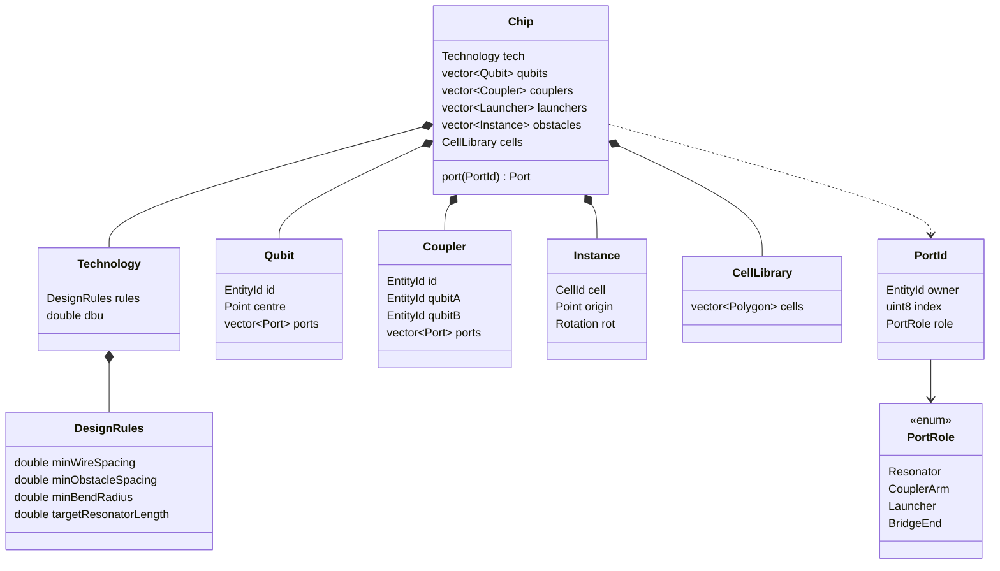

# Data model

The FlatBuffers schemas in `schemas/` are normative. This document explains
them: what the entities mean, which coordinate system each value lives in, and
which prototype defect each design choice removes.

## Why this exists

In the FridgeCAD prototype there was no data model. Entity semantics were
encoded in label strings and recovered by string matching at the point of use:

- A launcher was any port whose label started with `Chip`.
- A qubit was any port whose label started with `Qb` — except in the places that
  tested for `Q`, which also matched `Coupler`.
- The qubit pair belonging to a coupler was recovered by parsing the digits out
  of names like `Coupler12_16`.
- Bridge partners were hard-coded as ports `3` and `4`, or `1` and `2`,
  depending on which function was asking.
- Synthetic labels such as `CouplerLauncher1_Chip.port113first` could not be
  parsed back into their parts, which forced a special case in the clearance
  checker.

Every one of those is a class of bug that a type system removes for free.

## Entities



### Identity

`EntityId` is a strong typedef over `uint32`, not a string and not a bare
integer. `PortId` is the triple of owning entity, port index, and role.

Two rules follow, and they are the point of the whole exercise:

1. **Strings appear only at the I/O boundary.** A label is something a chip
   description may carry for human benefit and that reports may print. No
   algorithm branches on one.
2. **Relationships are stored, never parsed.** `Coupler::qubitA` and
   `Coupler::qubitB` are fields. Nothing recovers them from a name.

`PortRole` replaces every prefix test in the prototype. A port either is a
launcher or it is not, and the type says so.

### Geometry and the cell library

`Chip` stores obstacle geometry as a `CellLibrary` of distinct polygons plus a
list of `Instance` placements, each an index into the library with an origin and
a rotation.

This is the same hierarchy GDSII uses, which makes export close to mechanical.
It also solves a practical problem: the prototype's 69-qubit configuration was
**34 MB** because it stored 13,316 fully expanded obstacle polygons, when those
polygons are overwhelmingly repeated qubit and coupler artwork. Expressed as a
library plus placements, the same chip is tens of kilobytes.

### Design rules

`DesignRules` is one struct, threaded through every stage, and it is the only
place a clearance value may come from.

The prototype had three contradictory sets of the same physical constants —
`CON_MIN_WIRE_DIST` was 185 in the capacity stage, 70 in the detail stage, and
185 again in the final stage — while the value actually enforced during routing
was `outer_min_dist_wires = 19`, expressed in grid cells and unrelated to any of
them. Stages that work in grid space convert from `DesignRules` on entry. They
do not declare their own constants.

## Coordinate systems

Four coordinate systems exist. Confusing them was a recurring source of defects,
so each has a distinct type and conversions are explicit.

| Space       | Type     | Unit                    | Where it is valid                                                   |
| ----------- | -------- | ----------------------- | ------------------------------------------------------------------- |
| Layout      | `Point`  | micrometres as `double` | The chip description, the geometry IR, all design rules, GDS export |
| Coarse grid | `GCoord` | cell index              | Capacity planning: partitions, budgets, chains                      |
| Detail grid | `DCoord` | pixel index             | Detail routing: the A* over partitions                              |
| Router grid | `RCoord` | node index plus heading | Final routing: the Dubins A* state, heading `0..7`                  |

Conversions live in `MQT::ScpdGrid` as named functions, never as inline
arithmetic at the call site. The prototype re-derived `pad + x * px_w` in six
separate renderers, each with its own y-flip convention.

`Rotation` and the router heading are both eight-way. That assumption is baked
into the A* state index and the flat primitive tables, where a heading is packed
as `(ang << 10) | path_id`. It is named as `kNumAngles` rather than spelled `8`
throughout, so it is greppable — but changing it is out of scope for the first
release. See
[decision 0015](decisions/0015-grid-and-memory-model.md).

## Paths

A routed wire is a sequence of **analytic segments**, not sampled points:

```text
Segment := Line{ start, end }
         | Arc { centre, radius, startAngle, sweep }
```

The router produces Dubins paths, which are exactly lines and circular arcs.
Storing them as such keeps the geometry exact through the pipeline, makes
bend-radius checking a direct comparison rather than an inference from sampled
points, and lets the export adapter choose its own resolution.

The prototype sampled early and then spent 419 lines in `align_routed_paths`, on
top of a 1,771-line helper block, reconstructing arc structure from polylines it
had itself flattened.

Sampling happens exactly once, in the KLayout adapter, at a tolerance taken from
the configuration.

## Schema evolution

- Schemas live in `schemas/*.fbs` and are the single source of truth. Generated
  C++ headers and Python modules are committed under
  `include/mqt-scpd/generated/` and `python/mqt/scpd/generated/`, regenerated by
  `uvx nox -s schemas`. CI fails if the committed output is stale.
- FlatBuffers' own rules apply: add fields at the end of a table, never
  renumber, never change a field's type, and mark removed fields `deprecated`.
- Every run directory records the schema version it was written with. Loading a
  run written by an incompatible version fails with a clear message rather than
  misreading it.

## Validation

`chip.json` and `config.toml` are user-authored input and therefore a trust
boundary. Both are validated on load, against the same schemas that define the
binary artifacts, and both report actionable errors that name the offending
field.

Per the project's minimalism rules, trust-boundary validation is one of the
things that is never trimmed for brevity.
