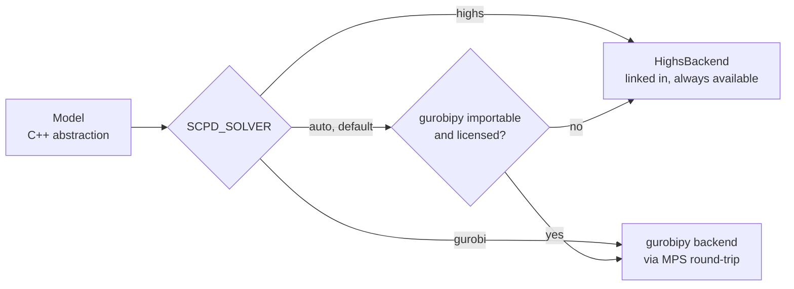

# Pipeline

Six stages, each a typed interface with one implementation in the first release.
This document defines what each stage promises, what it writes, and how a run is
resumed.

## Stage contracts

Every stage entry point has the same shape:

```cpp
struct IDetailRouter {
  virtual ~IDetailRouter() = default;
  virtual DetailRouting run(const Chip&, const GlobalRouting&,
                            const Config&) const = 0;
};
```

Three properties hold for all six, and they are contractual rather than
incidental:

- **`const` and by-reference input.** A stage may not modify its inputs. The
  prototype passed the chip by value into three stages — copying 13,316 polygons
  each time — and had the assignment stage write into the capacity stage's
  request queue while its own solver was still running.
- **Value output.** A stage returns a new object. There is no shared mutable
  design database.
- **Deterministic.** Given the same inputs and configuration, a stage produces
  the same output. No dependence on pointer values, hash iteration order, or
  wall-clock time.

The third property is what makes resume meaningful and property tests
reproducible. It is also what will make the phase-2 threading tractable.

| Stage      | Interface          | Reads            | Writes           |
| ---------- | ------------------ | ---------------- | ---------------- |
| Capacity   | `ICapacityPlanner` | chip             | `01-capacity.fb` |
| Assignment | `IAssigner`        | chip, capacity   | `02-assign.fb`   |
| Global     | `IGlobalRouter`    | chip, assignment | `03-global.fb`   |
| Detail     | `IDetailRouter`    | chip, global     | `04-detail.fb`   |
| Final      | `IFinalRouter`     | chip, detail     | `05-final.fb`    |
| Finalize   | `IFinalizer`       | chip, final      | `06-geometry.fb` |

### Capacity

Rasterizes the chip, computes a Euclidean distance transform, partitions free
space by watershed over that transform, and budgets how many wires may cross
each partition border. Produces the capacity chains that later stages route
along.

### Assignment

Assigns resonators to launchers as a minimum-overlap problem on the ring of
outer ports. Mixed-integer program.

**Note for implementers.** In the prototype this stage called back into the
capacity grid *during model construction*, running a graph search per node to
find each port's nearest launcher, and mutated the capacity grid after solving.
Those lookups must be precomputed into a plain `AssignmentInputs` value before
the model builder runs. Until that is done the model is not separable from the
geometry engine, and the solver abstraction cannot work.

### Global

Solves the inner circuit as a binary flow model on the Hanan lattice induced by
each capacity chain's port set. Mixed-integer program.

### Detail

A* on the pixel grid, one partition at a time, then stitching of per-partition
fragments into wires, then re-routing of wires that cross partition borders.

### Final

Curvature-constrained A* over Dubins primitives, coplanar-waveguide coupler
insertion, feedline routing, air-bridge placement, and design-rule enforcement.
This is the expensive stage: roughly 78 percent of wall time on the largest
benchmark.

### Finalize

Fits the routed paths to their exact analytic form, inserts meanders to reach
target resonator lengths, and instantiates couplers and bridges. Produces the
geometry IR.

## The run directory

```text
run/
  00-chip.json        input, copied for provenance
  config.toml         input, copied for provenance
  01-capacity.fb
  02-assign.fb
  03-global.fb
  04-detail.fb
  05-final.fb
  06-geometry.fb
  metrics.json
  log.jsonl
```

### Formats

| Artifact                      | Format                                           | Why                                                                                  |
| ----------------------------- | ------------------------------------------------ | ------------------------------------------------------------------------------------ |
| `00-chip.json`, `config.toml` | JSON and TOML text, validated against the schema | Human-authored and generator-written; editability is a requirement                   |
| `01-` through `06-`           | Binary FlatBuffers                               | Machine state. Typed, compact, versioned                                             |
| `metrics.json`, `log.jsonl`   | JSON                                             | Consumed by `jq`, pandas and the report command. Deliberately not schema-constrained |

Binary does not mean opaque. `mqt-scpd inspect run/04-detail.fb` prints the
artifact as schema-driven JSON.

### What is never an artifact

Grids and router containers are **derived state**. On the largest benchmark the
capacity grid alone holds around 500 MB and each router context holds up to 1.87
GB. None of it is serialized. It is rebuilt deterministically from the chip and
the configuration when a stage starts.

This rule is what keeps every artifact small, and it is why the choice of
encoding is a detail rather than a constraint.

## Resume

```bash
mqt-scpd route chip.json -c config.toml -o run/     # all stages
mqt-scpd detail run/ --router astar-dubins          # rewrite 04 onward
mqt-scpd final run/                                 # resume from 04
```

Running a stage invalidates every artifact after it; the CLI deletes them rather
than leaving a run directory in a mixed state.

Resume exists because the largest benchmark takes around 456 seconds end to end
and the last two stages are most of that. Iterating on the detail router should
not require re-solving two mixed-integer programs.

An integration test asserts that resuming from a checkpoint produces the same
result as an uninterrupted run.

## Algorithm selection

Each stage interface has a registry keyed by name:

```console
$ mqt-scpd list-algorithms
assigner:      ordered-milp
global-router: hanan-milp
detail-router: astar-dubins
final-router:  dubins
```

Selection comes from `config.toml` and may be overridden per invocation with
`--assigner`, `--detail-router` and so on. The first release ships exactly one
implementation per stage; the registry exists so that the second one is a new
file rather than a refactor.

## Solver backends

Stages Assignment and Global build mixed-integer programs through the
solver-neutral `Model` type in `MQT::ScpdMilp`.



HiGHS is vendored and always present, so an unlicensed installation is fully
functional. Gurobi is reached at run time through `gurobipy` if the user has it
installed and licensed. See
[decision 0001](decisions/0001-byok-milp-solver.md).

## Logging and metrics

The core logs through spdlog into a JSON-lines sink. It does not write to
`stdout`.

The prototype's log *was* its API: the benchmark harness recovered failure
counts by regular expression from lines like
`[Final Feedline-Constrained Routing] ... Failed 0`, a 69-qubit run emitted
71,518 such lines, and renaming a tag broke the harness. Metrics are now a
structured value the core produces and `metrics.json` records.

Human-readable output is rendered in Python from `metrics.json`, never by
`printf` in the core.

## Configuration

One `config.toml`, covering algorithm selection and every tuning parameter.

The prototype spread configuration across two parameter structs — several of
whose fields were `const`, making the structs non-assignable — plus 38 `getenv`
sites, plus roughly fifteen constants hard-coded at call sites. Every one of
those becomes a documented configuration key with a default, or is deleted.
