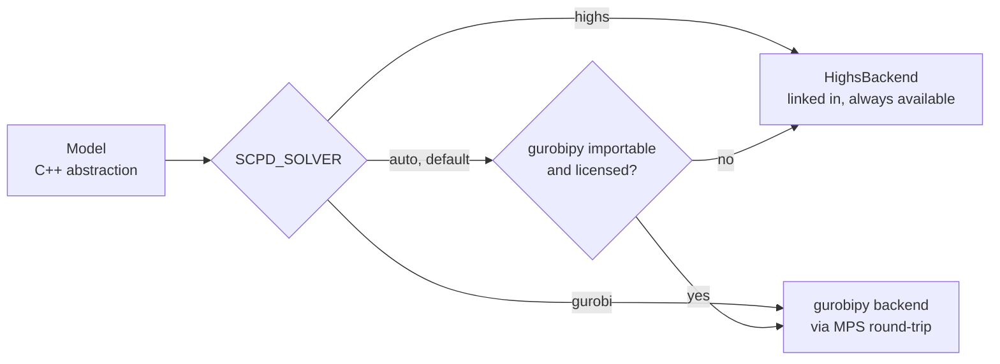

# Pipeline

Six stages, each a typed interface with one implementation in the first release.
This document defines what each stage promises, what it writes, and how a run is
resumed.

## Stage contracts

Every stage entry point has the same shape:

```cpp
struct IDetailRouter {
  virtual ~IDetailRouter() = default;
  virtual DetailRouting run(const Chip&, const GlobalRouting&,
                            const Config&) const = 0;
};
```

Three properties hold for all six, and they are contractual rather than
incidental:

- **`const` and by-reference input.** A stage may not modify its inputs. The
  prototype passed the chip by value into three stages — copying 13,316 polygons
  each time — and had the assignment stage write into the capacity stage's
  request queue while its own solver was still running.
- **Value output.** A stage returns a new object. There is no shared mutable
  design database.
- **Deterministic.** Given the same inputs and configuration, a stage produces
  the same output. No dependence on pointer values, hash iteration order, or
  wall-clock time.

The third property is what makes resume meaningful and property tests
reproducible. It is also what will make the phase-2 threading tractable.

| Stage      | Interface          | Reads            | Writes           |
| ---------- | ------------------ | ---------------- | ---------------- |
| Capacity   | `ICapacityPlanner` | chip             | `01-capacity.fb` |
| Assignment | `IAssigner`        | chip, capacity   | `02-assign.fb`   |
| Global     | `IGlobalRouter`    | chip, assignment | `03-global.fb`   |
| Detail     | `IDetailRouter`    | chip, global     | `04-detail.fb`   |
| Final      | `IFinalRouter`     | chip, detail     | `05-final.fb`    |
| Finalize   | `IFinalizer`       | chip, final      | `06-geometry.fb` |

### Capacity

Rasterizes the chip, computes a Euclidean distance transform, partitions free
space by watershed over that transform, and budgets how many wires may cross
each partition border. Produces the capacity chains that later stages route
along.

### Assignment

Assigns resonators to launchers as a minimum-overlap problem on the ring of
outer ports, which is `[ports.sequences].all_outer` from the configuration
rather than something derived from geometry. Mixed-integer program, bounded by
`max_feedline_utilization` and permitted `feedline_terminations` extra
endpoints.

**This is where `AssignedRole` is set.** Every connection the assignment
produces carries a source and target role. The one role it cannot place yet is
`ResonatorSource`, whose port does not exist until the Final stage inserts the
coupler that carries it; the assignment records that the resonator is fed, and
the Final stage completes the pair.

**Note for implementers.** In the prototype this stage called back into the
capacity grid *during model construction*, running a graph search per node to
find each port's nearest launcher, and mutated the capacity grid after solving.
Those lookups must be precomputed into a plain `AssignmentInputs` value before
the model builder runs. Until that is done the model is not separable from the
geometry engine, and the solver abstraction cannot work.

### Global

Solves the inner circuit as a binary flow model on the Hanan lattice induced by
each capacity chain's port set. Mixed-integer program.

A chip with no inner circuit — the 4-qubit benchmark, whose `all_outer` is its
entire port ring — makes this stage a no-op. That is a valid pipeline state and
`03-global.fb` is written empty, not skipped.

### Detail

A* on the pixel grid, one partition at a time, then stitching of per-partition
fragments into wires, then re-routing of wires that cross partition borders.

### Final

Curvature-constrained A* over Dubins primitives, coplanar-waveguide coupler
insertion, feedline routing, and design-rule enforcement. This is the expensive
stage: roughly 78 percent of wall time on the largest benchmark.

The prototype's live sequence, which the port reproduces:

```text
inner routing        stubs inside each unit cell
outer routing        the resonator and conventional wires
coupler insertion    CPW couplers instantiated; ResonatorSource ports created
feedline routing     the launcher-to-launcher chains, with rip-up repair
feedline refinement
```

with a clearance check after every routing pass.

**Coupler placement and feedline routing are one fixpoint, not two steps.** The
feedline repair loop re-orients an already-placed coupler when doing so is what
lets a chain route, so the stage cannot be split into "place couplers, then
route feedlines" without losing the mechanism that reaches zero failures. The
`IFinalRouter` implementation must be shaped around that.

### Finalize

Fits the routed paths to their exact analytic form, inserts meanders to reach
`target_resonator_length`, rebuilds each coupler at its true physical
dimensions, and instantiates an air-bridge wherever a feedline chain crosses a
regular wire. Produces the geometry IR.

## The run directory

```text
run/
  00-chip.json        the routing config, copied for provenance
  config.toml         input, copied for provenance
  01-capacity.fb
  02-assign.fb
  03-global.fb
  04-detail.fb
  05-final.fb
  06-geometry.fb
  metrics.json
  drc.json            DRCPolice findings, one report per checked stage
  log.jsonl
```

### Formats

| Artifact                      | Format                                   | Why                                                                                  |
| ----------------------------- | ---------------------------------------- | ------------------------------------------------------------------------------------ |
| `00-chip.json`, `config.toml` | The prototype's JSON, and validated TOML | Human-authored; the chip format is unchanged so the routing baseline is unchanged    |
| `01-` through `06-`           | Binary FlatBuffers                       | Machine state. Typed, compact, versioned                                             |
| `metrics.json`, `log.jsonl`   | JSON                                     | Consumed by `jq`, pandas and the report command. Deliberately not schema-constrained |
| `drc.json`                    | JSON from a schema-defined `DrcReport`   | A violation must be machine-readable to be overlaid, diffed and gated on             |

Binary does not mean opaque, and it does not mean unviewable.
`mqt-scpd inspect run/04-detail.fb` prints the artifact as schema-driven JSON,
and `mqt-scpd plot run/ --stage detail` renders it as SVG.

### Rendering a run

`plot` reads artifacts and nothing else, so it works on a partial run directory
— which is the point, since it is the instrument for watching the port make
progress stage by stage.

| `--stage`  | Reads            | Renders                                               |
| ---------- | ---------------- | ----------------------------------------------------- |
| `layout`   | `00-chip.json`   | obstacles, ports coloured by `UnassignedRole`         |
| `capacity` | `01-capacity.fb` | + partitions, bottlenecks, budgets, routed chains     |
| `detail`   | `04-detail.fb`   | + pixel paths                                         |
| `final`    | `05-final.fb`    | + Dubins paths, couplers, bridges                     |
| `aligned`  | `06-geometry.fb` | fitted analytic wires, real coupler/bridge footprints |

Pixel fields are rendered as one downsampled raster, never one element per
pixel. The prototype's equivalent 4-qubit capacity view is 17.8 MB because it
did the latter; the budget here is 2 MB per snapshot on every benchmark. See
[decision 0021](decisions/0021-debug-rendering-in-python.md).

### What is never an artifact

Grids and router containers are **derived state**. On the largest benchmark the
capacity grid alone holds around 500 MB and each router context holds up to 1.87
GB. None of it is serialized. It is rebuilt deterministically from the chip and
the configuration when a stage starts.

This rule is what keeps every artifact small, and it is why the choice of
encoding is a detail rather than a constraint.

## Design-rule checking

**DRCPolice** — `DrcPolice` in `MQT::ScpdDrc` — is the tool's design-rule
checker. It runs after the Final stage and again after Finalize, and it is not
optional: KLayout ships no design-rule checking to defer to, so this is the only
thing standing between a routed chip and a claim that it is manufacturable. See
[decision 0022](decisions/0022-drc-in-the-core.md).

### One rule set, two geometry views

The two checked stages hold the design in different coordinate systems: the
Final stage in router cells, the Finalize stage in analytic segments in layout
units. The prototype answered that by implementing its clearance check twice,
once per space, and letting the two drift.

Each rule here is written **once**, against a view the stage supplies:

```cpp
/// What a rule sees. Supplied by the Final stage in router cells, and by the
/// Finalize stage in layout units.
struct DrcView {
  std::span<const CheckedWire>   wires;      // polyline, or analytic segments
  std::span<const Polygon>       obstacles;
  std::span<const PlacedCoupler> couplers;
  std::span<const PlacedBridge>  bridges;
  Unit                           unit;       // Cells{cellSize} | Layout
};
```

A rule converts each `DesignRules` value into the view's unit once — through
`cells_for` in cell space, directly in layout space — and appends findings to
one `DrcReport`. Running the same rules over both views is also how a
disagreement between the routed and the fitted geometry becomes visible; nothing
compares them today.

### The rules

An **advisory** rule is compiled and unit-tested but skipped on a normal run.
`--drc-all`, or `[drc] all = true`, runs every rule.

| #   | Rule                     | Default  | View     | What it checks                                                                     |
| --- | ------------------------ | -------- | -------- | ---------------------------------------------------------------------------------- |
| 1   | `wire-clearance`         | active   | both     | No two different wires closer than `min_wire_spacing`. Exemptions below            |
| 2   | `feedline-orthogonality` | active   | both     | A wire crossing a regular feedline must cross it orthogonally                      |
| 3   | `wire-loop`              | advisory | both     | A wire's path self-intersects or revisits a cell                                   |
| 4   | `obstacle-clearance`     | active   | both     | No wire closer than `min_obstacle_spacing` to a chip obstacle polygon              |
| 5   | `component-overlap`      | advisory | both     | Coupler and bridge footprints are disjoint from each other and from components     |
| 6   | `min-straight-length`    | advisory | both     | Every straight run between two curvature changes is at least `min_straight_length` |
| 7   | `resonator-length`       | active   | Finalize | Every resonator within `resonator_length_tolerance` of `target_resonator_length`   |
| 8   | `min-bend-radius`        | advisory | Finalize | Every arc radius is at least `min_bend_radius`                                     |

Rule 2 runs the router's own `crossing_allowed_orthogonal` test in cell space,
so what it reports is exactly what the router would have refused to produce; the
layout-space form is geometric. Rules 7 and 8 are Finalize-only because a
resonator's true length exists only after the fit, and an arc radius is a stored
field of the geometry IR rather than something inferred from samples — which is
the argument for analytic segments in [the data model](data-model.md#paths).
Rule 6 walks the same segment decomposition as rule 8, so the two are built
together.

### Rule 1's exemptions

Three encounter classes are not violations, and each exists because a working
design does it on purpose:

- **Regular coupler-to-coupler feedlines are excluded from the check entirely.**
  Other wires are *meant* to cross them — that is what the air-bridges are for —
  so a clearance rule against them would measure something the design never
  asked for. First and last feedline edges are hard obstacles for every wire and
  **are** checked. The number of feedlines skipped is reported, so a stage that
  starts skipping many more than usual stays visible.
- **Junctions are exempt.** Two wires that actually connect are allowed to
  touch: a first/last feedline runs launcher-to-resonator while the resonator is
  routed from that same coupler, so the two graze past their shared endpoint
  rather than parting cleanly.
- **A pair closer than `short_threshold` is a short, not a near-miss.** It is
  reported in its own class so a genuine short never hides in a list of
  near-misses.

The prototype decides "these two wires share a component" by parsing the
component name out of a port label, and needs a documented special case for
synthetic labels like `CouplerLauncher1_Chip.port25zero`, whose name embeds
another port's name and would otherwise collapse every launcher on one pad into
a single bogus component. Under
[decision 0018](decisions/0018-port-roles-unassigned-and-assigned.md) that
branch does not exist: a port carries a `PortRef` and a role, so the test is a
field comparison. The rule ports over as strictly less code than it is today.

### Behaviour

- Both reports go to `drc.json`, tagged by stage, and are summarized in the run
  table alongside failures and angle cost.
- **A violation does not abort the run.** The pipeline finishes, so the
  artifacts and the SVG that explain the violation exist; the CLI then exits
  nonzero. Aborting at the point of detection would destroy the evidence needed
  to diagnose it.
- Advisory findings are counted separately and never affect the exit code.
- `mqt-scpd drc run/` re-checks an existing run directory without re-routing,
  and `mqt-scpd plot --stage final|aligned --drc` overlays the findings on the
  SVG. Both work on a run produced by an earlier build.

## Resume

```bash
mqt-scpd route -c benchmarks/69q/config.toml -o run/   # all stages
mqt-scpd detail run/ --router astar-dubins             # rewrite 04 onward
mqt-scpd final run/                                    # resume from 04
```

Running a stage invalidates every artifact after it; the CLI deletes them rather
than leaving a run directory in a mixed state.

Resume exists because the largest benchmark takes around 456 seconds end to end
and the last two stages are most of that. Iterating on the detail router should
not require re-solving two mixed-integer programs.

An integration test asserts that resuming from a checkpoint produces the same
result as an uninterrupted run.

## Algorithm selection

Each stage interface has a registry keyed by name:

```console
$ mqt-scpd list-algorithms
assigner:      ordered-milp
global-router: hanan-milp
detail-router: astar-dubins
final-router:  dubins
```

Selection comes from `config.toml` and may be overridden per invocation with
`--assigner`, `--detail-router` and so on. The first release ships exactly one
implementation per stage; the registry exists so that the second one is a new
file rather than a refactor.

## Solver backends

Stages Assignment and Global build mixed-integer programs through the
solver-neutral `Model` type in `MQT::ScpdMilp`.



HiGHS is vendored and always present, so an unlicensed installation is fully
functional. Gurobi is reached at run time through `gurobipy` if the user has it
installed and licensed. See
[decision 0001](decisions/0001-byok-milp-solver.md).

## Logging and metrics

The core logs through spdlog into a JSON-lines sink. It does not write to
`stdout`.

The prototype's log *was* its API: the benchmark harness recovered failure
counts by regular expression from lines like
`[Final Feedline-Constrained Routing] ... Failed 0`, a 69-qubit run emitted
71,518 such lines, and renaming a tag broke the harness. Metrics are now a
structured value the core produces and `metrics.json` records.

Human-readable output is rendered in Python from `metrics.json`, never by
`printf` in the core.

## Configuration

One `config.toml` per chip, covering the port patterns, the outer port
sequences, the design rules, the grid geometry, algorithm selection and every
tuning parameter.

```toml
[chip]
input = "routing_config.json"

[ports.patterns]                     # first match wins; every port matches one
launcher     = '^Chip\.port\d+$'
resonator    = '^Qb?\d+\.port0$'
conventional = '^(Qb?\d+\.port1|Coupler\d+_\d+\.port[0-4])$'

[ports.sequences]
all_outer   = ["Qb1.port0", "Qb1.port1", "Coupler1_2.port3", "..."]
fixed_outer = []

[design_rules]                       # always written out in full
min_wire_spacing         = 185.0
min_obstacle_spacing     = 25.0
min_bend_radius          = 50.0
min_straight_length      = 100.0
target_resonator_length  = 2500.0
resonator_length_tolerance = 100.0
max_feedline_utilization = 6
feedline_terminations    = 0

[grid]
capacity_cells_x  = 50               # capacity_cells_y defaults to the chip aspect
launcher_offset_x = 15               # ratio; 17Q is the one chip that sets it
launcher_offset_y = 15

[stages.assignment]
launcher_target = 24

[stages.final]
meander_length    = 600.0
expansion         = 200
rounds            = 10
refinement_rounds = 15
```

**A shipped config carries only what differs from the defaults**, with
`[design_rules]` as the single exception: every rule is written out every time,
because the rules are the physical contract a run is judged against and a
reviewer should not have to cross-reference a table to see the clearances a chip
was built to. `mqt-scpd doctor --config` enforces both halves — it fails on a
key outside `[design_rules]` set to its own default, and on a `[design_rules]`
key that is missing — and CI runs it over every benchmark config.

The rule has teeth: five of the eight prototype drivers set
`outer_max_relaxation = 5`, which is already the default, and two set
`outer_use_meander = true`, likewise. Those lines say nothing and would drift
without anyone noticing. Coupler and bridge dimensions are configurable for the
same reason the rules are — they are physical facts about the design — but no
benchmark overrides them today, so they appear in no config.

The whole `[drc]` block is in the same position. Every key below is overridable,
all eight benchmarks run on the defaults, and therefore
**no shipped config contains a `[drc]` section at all**:

| Key                                       | Default | Meaning                                                                   |
| ----------------------------------------- | ------- | ------------------------------------------------------------------------- |
| `drc.all`                                 | `false` | Also run the advisory rules; `--drc-all` sets it per run                  |
| `drc.rules.wire-loop`                     | `false` | Advisory                                                                  |
| `drc.rules.component-overlap`             | `false` | Advisory                                                                  |
| `drc.rules.min-straight-length`           | `false` | Advisory                                                                  |
| `drc.rules.min-bend-radius`               | `false` | Advisory                                                                  |
| `drc.wire_clearance.short_threshold`      | `2.0`   | Below this two wires are one net, not a near-miss                         |
| `drc.wire_clearance.junction_radius_norm` | `1.5`   | × the required clearance; how far past a junction two wires may still hug |

`junction_radius_norm` is a named key rather than a literal because in the
prototype it is one: the junction radius is `1.5 · R` with nothing recording
where 1.5 came from.

`resonator_length_tolerance` is the exception, and sits in `[design_rules]`
instead. It is a physical property of the chip that qualifies
`target_resonator_length` directly beside it, so it follows that section's rule
and is written out in every config.

The prototype spread configuration across two parameter structs — several of
whose fields were `const`, making the structs non-assignable — plus **72**
`getenv` sites, plus roughly fifteen constants hard-coded at call sites, plus
per-benchmark hand tuning in ten driver programs.

The `getenv` sites are **deleted outright**, not migrated. They are debug and
sweep knobs from a research process, and carrying them forward would recreate
the problem in a new place. `config.toml` is the only tuning surface; the sole
environment variable that survives is `SCPD_SOLVER` from
[decision 0001](decisions/0001-byok-milp-solver.md).

One of them earns a CLI flag rather than deletion. `FG_CLEARANCE_DEBUG` lists
every pair the clearance check *exempted*, together with the closest non-exempt
approach that pair still has — the way to confirm an exemption is not quietly
swallowing a real violation. That is a genuine diagnostic, and it becomes
`--drc-verbose`.

Most of the per-benchmark hand tuning has already collapsed upstream. The three
routing penalties that shipped as values between 8,000 and 30,000 across
benchmarks are now expressed relative to grid size — one triple of normalized
constants drives every chip — and are therefore defaults here, absent from all
eight configs.
